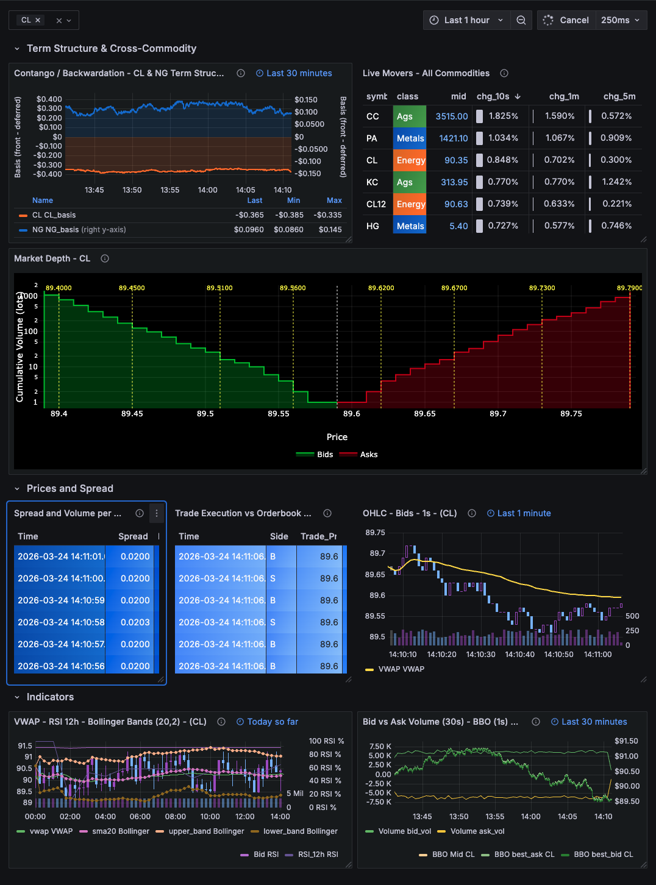

# Commodities Data Generator

High-fidelity synthetic commodities market data generator for QuestDB. Produces realistic order books, trades, and daily settlements for 25 commodity instruments across energy, power, metals, and agriculture.

All prices are anchored to real market data via Yahoo Finance (19 symbols) and the EIA API (4 power hubs). Deferred contracts (CL12, NG12) track their front month with a drifting basis offset.

## Instruments (28 symbols)

### Energy (9)

| Symbol | Name | Exchange | Unit | Source |
|--------|------|----------|------|--------|
| CL | WTI Crude Oil | NYMEX | bbl | Yahoo Finance |
| BZ | Brent Crude Oil | ICE | bbl | Yahoo Finance |
| NG | Natural Gas Henry Hub | NYMEX | MMBtu | Yahoo Finance |
| TTF | Dutch TTF Gas | ICE | MWh | Yahoo Finance |
| RB | RBOB Gasoline | NYMEX | gal | Yahoo Finance |
| HO | Heating Oil | NYMEX | gal | Yahoo Finance |
| JKM | LNG Japan-Korea | ICE | MMBtu | Yahoo Finance |
| CL12 | WTI Crude 12-Month | NYMEX | bbl | Derived from CL |
| NG12 | Nat Gas 12-Month | NYMEX | MMBtu | Derived from NG |

### Power (4)

| Symbol | Name | Exchange | Unit | Source |
|--------|------|----------|------|--------|
| PJM | PJM Western Hub | ICE | MWh | EIA API (PA industrial) |
| ERCT | ERCOT North Texas | ICE | MWh | EIA API (TX industrial) |
| CISO | CAISO South (SP15) | ICE | MWh | EIA API (CA industrial) |
| NBPL | New England (NEPOOL) | ICE | MWh | EIA API (MA industrial) |

### Metals (8)

| Symbol | Name | Exchange | Unit | Source |
|--------|------|----------|------|--------|
| GC | Gold | COMEX | oz | Yahoo Finance |
| SI | Silver | COMEX | oz | Yahoo Finance |
| HG | Copper | COMEX | lb | Yahoo Finance |
| PL | Platinum | NYMEX | oz | Yahoo Finance |
| PA | Palladium | NYMEX | oz | Yahoo Finance |
| GC6 | Gold 6-Month | COMEX | oz | Real COMEX contract month |
| GC12 | Gold 12-Month | COMEX | oz | Real COMEX contract month |
| SI12 | Silver 12-Month | COMEX | oz | Real COMEX contract month |

### Agriculture (7)

| Symbol | Name | Exchange | Unit | Source |
|--------|------|----------|------|--------|
| ZC | Corn | CBOT | bu | Yahoo Finance |
| ZS | Soybeans | CBOT | bu | Yahoo Finance |
| ZW | Wheat | CBOT | bu | Yahoo Finance |
| KC | Coffee | ICE | lb | Yahoo Finance |
| CC | Cocoa | ICE | MT | Yahoo Finance |
| SB | Sugar | ICE | lb | Yahoo Finance |
| CT | Cotton | ICE | lb | Yahoo Finance |

## Price Anchoring

All generated prices are anchored to real market data so they remain realistic even during volatile periods.

### Yahoo Finance (19 symbols)

Energy, metals, and agriculture symbols fetch the latest daily close from Yahoo Finance at startup. In real-time mode, brackets refresh every 5 minutes (configurable via `--yahoo_refresh_secs`). Prices are constrained to a +/-1% bracket around the latest close.

If Yahoo is unreachable, the generator falls back to wide static brackets that cover historical extremes (e.g. CL: $30-$150).

### EIA API (4 power symbols)

Power hub prices are anchored to the EIA's monthly industrial retail electricity prices per state (the `electricity/retail-sales` endpoint). This provides actual $/kWh prices which are converted to $/MWh:

- **PJM** - Pennsylvania industrial rate
- **ERCOT** - Texas industrial rate
- **CAISO** - California industrial rate
- **NEPOOL** - Massachusetts industrial rate

These prices update monthly and reflect real market conditions including crisis-driven spikes.

**An EIA API key is required** for power hub price anchoring. The key is free - register at:

https://www.eia.gov/opendata/register.php

Pass it via `--eia_api_key YOUR_KEY`. Without a key, power symbols fall back to static brackets.

### Deferred Contracts (5 symbols)

`CL12`, `NG12`, `GC6`, `GC12` and `SI12` are anchored to **real listed contract
months**, not to a synthetic offset. Their ticker column holds a spec like
`"@GC+6"`, which resolves at every bracket refresh to the nearest delivery month
at least N months out, using each root's actual listed cycle (gold trades
G/J/M/Q/V/Z, silver H/K/N/U/Z, crude and gas all twelve):

```
[YF] GC6:  @GC+6  -> GCJ27.CMX
[YF] GC12: @GC+12 -> GCV27.CMX
[YF] CL12: @CL+12 -> CLU27.NYM
```

Because it is resolved rather than hard-coded, the demo does not break when a
contract expires and rolls.

Each deferred mid then tracks its front month plus the **real curve basis**, so
the strip co-moves the way a term structure does while carrying the live shape.
That gives two genuinely different curves side by side, straight from the market:

| Curve | Front | +6M | +12M | Shape |
|-------|-------|-----|------|-------|
| Gold | 4405 | 4476 | 4639 | **Contango** - deferred above front, the cost of carry |
| Crude | 100.5 | - | 72.6 | **Backwardation** - deferred below front, front-month tightness |

If Yahoo cannot price a contract, that symbol falls back to a front-derived
bracket and the basis degrades to the previous synthetic behaviour rather than
failing.

### Adverse Selection (Toxicity Model)

Trades carry `venue`, `counterparty` and `passive`, and the counterparty
assignment is **not random**. Random assignment produces a scorecard with visible
dispersion that is pure sampling noise, which collapses the moment anyone drills
into it. Instead each counterparty has a signed toxicity:

- **toxicity > 0** - informed flow. Trades *with* the next move, so we are
  adversely selected and mark out negative against them.
- **toxicity < 0** - uninformed flow. Hedgers and corporates trading on a
  production or funding schedule rather than a view; profitable to internalise.
- **toxicity = 0** - a coin flip, no edge either way.

`|toxicity|` is the probability the side is chosen by looking ahead rather than
at random, so `0.85` means 85% informed and 15% noise. Nothing is 1.0, because a
counterparty that is right every single time reads as synthetic.

The lookahead is `--toxicity_horizon_s` (default 60) and works identically in
both modes: faster-than-life reads the future mid straight out of the precomputed
plan, and real-time keeps a rolling buffer of already-decided seconds and emits
from its front.

The result is a scorecard that actually finds something. Measured 60s markout
against designed toxicity correlates at **0.94** over a 200k-event run:

| Counterparty | Fills | Markout 60s (bps) |
|---|---|---|
| HFT_ARB_01 | 1,523 | +26.4 |
| HFT_MM_03 | 1,529 | +12.2 |
| BANK_TIER1_03 | 6,724 | -1.6 |
| MINER_01 | 1,385 | -13.7 |
| REFINER_02 | 2,939 | -14.9 |

The markout *curve* is the part that sells it: informed flow starts **negative**
at 1s because it crosses the spread to get filled, turns positive as the
information plays out, peaks near the horizon, then decays. That shape is what a
real adverse-selection study looks like.

Venues (`CME_GLOBEX`, `ICE_WEBICE`, `DIRECT_API`, `RFQ_PLATFORM`, `OTC_VOICE`)
differ in both effective spread and how sharp their flow is. Screen venues route
to the exchange that actually lists the contract, so **venue must be compared
within a symbol** - a cross-instrument venue average measures the product mix,
not the venue. For gold alone the ordering is clean:

| Venue | Effective spread (bps) |
|---|---|
| DIRECT_API | 0.196 |
| CME_GLOBEX | 0.222 |
| RFQ_PLATFORM | 0.329 |
| OTC_VOICE | 0.535 |

## Table Schemas

### `commodities_market_data`

Full depth order books with array-based bids/asks.

```sql
CREATE TABLE commodities_market_data (
    timestamp TIMESTAMP_NS,
    symbol SYMBOL,
    exchange SYMBOL,
    commodity_class SYMBOL,
    bids DOUBLE[][],       -- bids[1]=prices, bids[2]=sizes
    asks DOUBLE[][],       -- asks[1]=prices, asks[2]=sizes
    best_bid DOUBLE,
    best_ask DOUBLE
) timestamp(timestamp) PARTITION BY HOUR;
```

**Order book invariants.** Every row satisfies:

- `best_ask >= best_bid + tick` - never crossed, and never *locked* either
- `bids[1]` strictly descending, `asks[1]` strictly ascending
- `best_bid == bids[1][1]` and `best_ask == asks[1][1]`

The one-tick floor is enforced explicitly. Quantizing the two sides
independently collapses them onto the same price whenever the spread is clamped
to a single tick and the mid sits near a tick boundary, which produced locked
books (spread exactly 0) on ~1% of rows. Zero spread drags every average-spread
panel, so `quantize_bbo()` widens the ask by a tick rather than letting the sides
meet.

### `commodities_trades`

Individual trade events with price, size, side, and the execution-quality
attribution columns.

```sql
CREATE TABLE commodities_trades (
    timestamp TIMESTAMP_NS,
    symbol SYMBOL,
    exchange SYMBOL,
    commodity_class SYMBOL,
    price DOUBLE,
    size LONG,
    side SYMBOL,          -- 'B' or 'S', the counterparty's side
    venue SYMBOL,         -- CME_GLOBEX, ICE_WEBICE, DIRECT_API, RFQ_PLATFORM, OTC_VOICE
    counterparty SYMBOL,  -- see Adverse Selection above
    passive BOOLEAN       -- true = rested and got filled, false = crossed the spread
) timestamp(timestamp) PARTITION BY HOUR;
```

`venue`, `counterparty` and `passive` support the markout analytics. An existing
`commodities_trades` table does not need migrating: QWP auto-creates the missing
columns on first write, though only a freshly created table picks up the declared
SYMBOL capacities.

### `commodities_settlements`

Daily settlement prices with open interest and volume (~23 rows/day, one per non-deferred symbol).

```sql
CREATE TABLE commodities_settlements (
    timestamp TIMESTAMP_NS,
    symbol SYMBOL,
    settlement_price DOUBLE,
    open_interest LONG,
    volume LONG
) timestamp(timestamp) PARTITION BY DAY;
```

## Materialized Views

Continuous (real-time):
- `commodities_bbo_1s` - last best bid/ask + spread per second
- `commodities_trades_ohlcv_1s` - OHLC + volume per second

Timed rollups:
- `commodities_bbo_1m` - REFRESH EVERY 1m
- `commodities_bbo_1h` - REFRESH EVERY 10m
- `commodities_trades_ohlcv_1m` - REFRESH EVERY 1m
- `commodities_trades_ohlcv_15m` - REFRESH EVERY 1m

## Event Rates

Default rates (per second, before scale_factor):
- Market data: 15-40 events/s
- Trades: 5-20 events/s

Events are rank-weighted: CL/NG/GC (rank 1) get the most activity, deferred months (rank 10) the least.

| Scale Factor | MD/s | Trades/s | Daily (23h active) |
|-------------|------|----------|-------------------|
| 1 (default) | ~30 | ~15 | ~2.5M MD + ~1.2M trades |
| 100 | ~3,000 | ~1,500 | ~250M MD + ~120M trades |

## Per-Class Volatility

Each commodity class has its own volatility profile controlling price evolution:

| Class | Drift (ticks) | Shock Prob | Shock Mult |
|-------|--------------|------------|------------|
| Energy | 3.0 | 0.5% | 20x |
| Power | 3.0 | 1.5% | 40x |
| Metals | 2.0 | 0.3% | 15x |
| Ags | 2.5 | 0.4% | 18x |

## Power Spike Model

Power symbols (PJM, ERCT, CISO, NBPL) have a spike/revert state machine:
- 2% chance per second to enter a spike (5-30 second duration)
- During spike: 10x normal drift, 50% shock probability
- After spike: price reverts toward pre-spike level over ~5 seconds

This produces realistic power market dynamics where prices can briefly spike to multiples of normal levels before reverting.

## Session Pacing

CME Globex hours (Sunday 5pm CT - Friday 4pm CT):
- **Active**: normal event rates
- **Settlement** (2:25-2:30 PM CT): elevated rates, daily settlement emission
- **Maintenance** (4:00-5:00 PM CT daily): no events
- **Off** (weekends, Friday after 4pm CT): no events

Settlements are emitted once per simulated day, for the 23 non-deferred symbols,
on the **rising edge of the settlement phase** (the first second of the 2:25 PM CT
window) and only by worker 0.

That has to be stateless. Faster-than-life re-invokes the worker once per chunk,
so any "already done today" flag resets mid-day: a per-worker flag wrote 33
settlements per symbol per day across 3 processes and 11 chunks, and anchoring it
to the settlement window alone still double-emitted whenever the 5-minute window
straddled a 15-minute chunk boundary. The rising edge is a pure function of the
timestamp, so it fires exactly once however the run is sharded.

A consequence worth knowing: a backfill window that never crosses 2:25 PM CT
produces no settlements at all. That is correct - the simulated clock never
reached settlement time - but it surprises you on short test windows.

Override with `--offsession_trades=trickle|full` for demos.

## Usage

### Real-time mode

```bash
python commodities_data_generator.py \
  --host 127.0.0.1 \
  --mode real-time \
  --processes 1 \
  --scale_factor 1 \
  --eia_api_key YOUR_KEY
```

### Backfill (faster-than-life)

```bash
python commodities_data_generator.py \
  --host 127.0.0.1 \
  --mode faster-than-life \
  --processes 6 \
  --scale_factor 50 \
  --total_market_data_events 100_000_000 \
  --start_ts "2025-11-11T00:00:00.000000Z" \
  --end_ts "2025-11-11T14:00:00.000000Z" \
  --eia_api_key YOUR_KEY
```

### Loading an Enterprise cluster

Two scripts drive a cluster. Both default to the VPC-internal endpoints, primary
first, and accept a `HOST` override. The QWP bearer token is read from
`~/qwp_token.txt` and is never passed on the command line or stored in the repo.

```bash
# History: a two-day backfill. Run once.
./commodities_enterprise_backfill.sh

# Live: keep running under systemd/screen/tmux alongside the backfill.
./commodities_enterprise_realtime.sh

# Different cluster:
HOST=primary.internal:9000,replica-a.internal:9000 ./commodities_enterprise_backfill.sh
```

**Run both.** They serve different halves of a demo:

- The **backfill** supplies history. The counterparty and venue markout panels
  are statistical estimates; at one minute of data they are indistinguishable
  from noise and the scorecard ranks the wrong names. They need volume.
- **Real-time** supplies "now". Every panel pinned to a trailing window is empty
  without it, and most of the order book dashboard is pinned that way.

If the cluster uses a self-signed certificate, both scripts pass
`--tls_verify unsafe_off`. Nothing else will connect: a self-signed cert chains
to no trusted root, so no choice of `--tls_ca` helps.

Note that `--total_market_data_events` is a hard **stop**, and it binds before
`--end_ts`. At the default 15-40 eps a 48h window needs ~4.7M events; set it
lower and the backfill silently stops partway through and reports success. Tune
the event *rate* to fill a window, and leave the cap generously above it.

### Stress test

```bash
python commodities_data_generator.py \
  --host 127.0.0.1 \
  --mode faster-than-life \
  --processes 8 \
  --scale_factor 100 \
  --total_market_data_events 500_000_000
```

## Command-Line Arguments

### Connection

The generator speaks [QWP](https://questdb.com/docs/connect/wire-protocols/overview/)
(QuestDB Wire Protocol) over WebSocket for **both SQL and writes**, through a
single `questdb.QuestDB` handle. There is no PG wire connection and no separate
ILP sender, so one endpoint (port 9000) and one credential cover DDL, metadata
probes and row ingestion alike.

This requires `questdb>=5.0.0` (Python 3.10+) and a QWP-capable QuestDB server.

| Argument | Default | Description |
|----------|---------|-------------|
| `--host` | 127.0.0.1 | QWP host, or a comma-separated list for HA failover. Entries without a port default to 9000. List the writable primary first. |
| `--user` | admin | Username for basic auth |
| `--password` | quest | Password for basic auth |
| `--token` | None | Bearer token. Takes precedence over `--user`/`--password`. |
| `--token_file` | None | Read the bearer token from a file, keeping it off the command line |
| `--qwp_tls` | false | Use `wss` instead of `ws` |
| `--tls_ca` | None | TLS root store: `os_roots`, `webpki_roots`, or a CA bundle path |
| `--tls_verify` | on | Set `unsafe_off` for a cluster with a **self-signed** certificate. No `--tls_ca` value can validate one, since it chains to no trusted root |
| `--durable_ack` | false | `request_durable_ack=on`, so a failover cannot lose acknowledged rows |
| `--store_forward_dir` | `<tmp>/commodities_qwp_sf` | Base dir for per-worker store-and-forward spill; each worker gets a `<dir>/commodities-<idx>` subdir, created if absent |
| `--enterprise` | false | Enterprise server: tables take a `STORAGE POLICY` instead of a `TTL` |

### Mode & Rates
| Argument | Default | Description |
|----------|---------|-------------|
| `--mode` | required | real-time or faster-than-life |
| `--market_data_min_eps` | 15 | Min market data events per second |
| `--market_data_max_eps` | 40 | Max market data events per second |
| `--trades_min_eps` | 5 | Min trade events per second |
| `--trades_max_eps` | 20 | Max trade events per second |
| `--scale_factor` | 1 | Multiplier for all event rates |
| `--total_market_data_events` | 1,000,000 | Target events (faster-than-life) |

### Time Window
| Argument | Default | Description |
|----------|---------|-------------|
| `--start_ts` | now | Start timestamp (faster-than-life only) |
| `--end_ts` | None | End timestamp |
| `--chunk_seconds` | 900 | Precompute chunk size |

### Generation
| Argument | Default | Description |
|----------|---------|-------------|
| `--processes` | 1 | Worker process count |
| `--min_levels` | 20 | Min order book depth |
| `--max_levels` | 20 | Max order book depth |
| `--create_views` | true | Create materialized views |
| `--short_ttl` | false | Enable short retention (see below) |
| `--prefix` | "" | Table name prefix |

#### Retention

`--short_ttl` applies retention, but the clause differs by edition and object
kind, because QuestDB accepts different things in each case:

| | `TTL` | `STORAGE POLICY` |
|---|---|---|
| Table (OSS) | yes | n/a |
| Table (Enterprise) | rejected on `ALTER` | yes |
| Materialized view (either) | yes | rejected |

So with `--short_ttl true`, tables get `TTL 3 DAYS` / `TTL 1 MONTH` on OSS and a
`STORAGE POLICY` on Enterprise (`--enterprise true`), while materialized views
always get a TTL. The Enterprise policy is:

```
TO REMOTE 1 hour, TO PARQUET 2 days, DROP LOCAL 3 months
```

`DROP LOCAL` must never appear without a remote tier ahead of it, or it is simply
deletion. An earlier version used `TO PARQUET 1 day, DROP LOCAL 3 days` with no
`TO REMOTE`, which would have destroyed any backfill of past dates on contact.

**Do not pass `--short_ttl` when loading a demo dataset for dates in the past.**
Every threshold is already exceeded the moment the data lands. Without the flag
no retention clause is emitted at all and the data simply persists.

### Session
| Argument | Default | Description |
|----------|---------|-------------|
| `--session_pacing` | true | Enable session-aware pacing |
| `--offsession_trades` | none | none, trickle, or full |
| `--session_tz` | America/Chicago | Session timezone |

### Data Sources
| Argument | Default | Description |
|----------|---------|-------------|
| `--yahoo_refresh_secs` | 300 | Yahoo refresh interval (real-time) |
| `--eia_api_key` | None | EIA API key ([register here](https://www.eia.gov/opendata/register.php)) |
| `--toxicity_horizon_s` | 60 | Lookahead used to decide informed vs uninformed flow. Markouts out to roughly this horizon carry signal; beyond it the edge decays |

## Grafana Dashboards

Two dashboards are included. Both import the same way and both use the QuestDB
datasource plugin (`questdb-questdb-datasource`) over PG wire on port 8812. The
generator itself no longer uses PG wire, but the Grafana plugin has no QWP path,
so 8812 still needs to be reachable from Grafana.

### `Commodities-Metals-TCA-Demo.json`

Gold-first dashboard covering the precious metals curve and execution quality.
Symbol dropdown defaults to `GC`.

**Precious Metals Term Structure**

| Panel | Description |
|-------|-------------|
| Gold Forward Curve | Front / 6M / 12M gold mids, each anchored to a real COMEX contract month, so the spacing between the lines is the actual market carry |
| Curve Snapshot | Latest mid per contract month for gold, silver and crude. Shows gold's contango against crude's backwardation in one table |
| Gold 12M Basis | `GC12 - GC` in dollars per ounce, via ASOF JOIN of the two legs onto a common 1s grid |

**Execution Quality**

| Panel | Description |
|-------|-------------|
| Counterparty Scorecard | Every fill paired with the mid 60s later via `HORIZON JOIN`, averaged per counterparty, colour-graded. One query over the full trade history, no pre-aggregation |
| Markout Decay Curve | The same markout at a grid of horizons in a single `HORIZON JOIN` pass. A `trend` panel, since the x axis is seconds after the fill rather than wall-clock time |
| Venue Scorecard | Effective spread and passive rate per venue **for the selected symbol only** |
| Passive vs Aggressive | What crossing the spread costs, for the selected symbol |

**Execution Benchmarks**

| Panel | Description |
|-------|-------------|
| VWAP vs TWAP vs Last | Native `vwap(price, size)` and `twap(price, timestamp)`. They diverge exactly when volume clusters, which is when the choice of benchmark changes what a fill is judged against |
| OHLC + Volume | Traded candles for the selected symbol |
| Market Depth | Plotly order book, shared with the other dashboard |

### `Commodities-Orderbook-Realtime-Demo.json`

The original cross-commodity order book dashboard, symbol dropdown defaulting to `CL`.



**Term Structure & Cross-Commodity** (top row, no symbol filter)

| Panel | Description |
|-------|-------------|
| Contango / Backwardation | Front month minus deferred month mid-price for CL vs CL12 (WTI Crude) and NG vs NG12 (Natural Gas). Positive values indicate backwardation (near-term premium), negative indicates contango. Uses ASOF JOIN on `commodities_bbo_1s`. |
| Live Movers | All 25 commodities ranked by most volatile in the last 10 seconds. Shows current mid-price and percentage change over 10s, 1m, and 5m horizons with color-coded gauge bars (green = up, red = down). Sorted by `abs(chg_10s)`. |

**Market Depth** (Plotly order book visualization)

| Panel | Description |
|-------|-------------|
| Market Depth | Interactive order book for the selected symbol. Green area = cumulative bid volume, red area = cumulative ask volume, white dotted line = mid-price, yellow dotted lines = top volume walls per segment. Uses `bids[][]` and `asks[][]` arrays with `array_cum_sum()`. |

**Prices and Spread** (per-symbol row)

| Panel | Description |
|-------|-------------|
| Spread and Volume | Rolling table of the last 6 seconds showing average bid-ask spread and aggregated bid/ask top-of-book volumes. Uses SAMPLE BY 1s on `commodities_market_data`. |
| Trade Execution vs Orderbook | Pairs each trade with the most recent order book snapshot via ASOF JOIN. Shows trade price, BBO at the time, and slippage in basis points relative to mid-price. Positive slippage = adverse execution. |
| OHLC - Bids - 1s | Candlestick chart of the best bid aggregated into 1-second bars with volume, plus a cumulative VWAP overlay line (yellow). |

**Indicators** (per-symbol row)

| Panel | Description |
|-------|-------------|
| VWAP / RSI / Bollinger | Multi-indicator candlestick chart using 15-minute OHLC bars from `commodities_trades_ohlcv_15m`. Overlays cumulative VWAP (from `commodities_trades_ohlcv_1m`), RSI-12h (from `commodities_bbo_1h`), and Bollinger Bands (20-period SMA +/- 2 standard deviations). |
| Bid vs Ask Volume + BBO | Aggregated bid and ask top-of-book volumes over 30-second intervals (bar-like), with best bid, best ask, and mid-price from `commodities_bbo_1s` overlaid. |

### Importing

1. In Grafana, go to Dashboards > Import
2. Upload `Commodities-Metals-TCA-Demo.json` or `Commodities-Orderbook-Realtime-Demo.json`
3. Select your QuestDB datasource when prompted
4. The dashboard auto-refreshes at 250ms-1s and uses a symbol dropdown (defaults to CL)

Requires the [Plotly panel plugin](https://grafana.com/grafana/plugins/ae3e-plotly-panel/) for the Market Depth chart.

## Dependencies

```
questdb[dataframe]==5.0.0
numpy>=2.0.2
yfinance==0.2.65
requests==2.32.3
```

`psycopg` is no longer needed: QWP replaced the PG wire connection. `questdb`
5.x requires Python 3.10 or newer.
