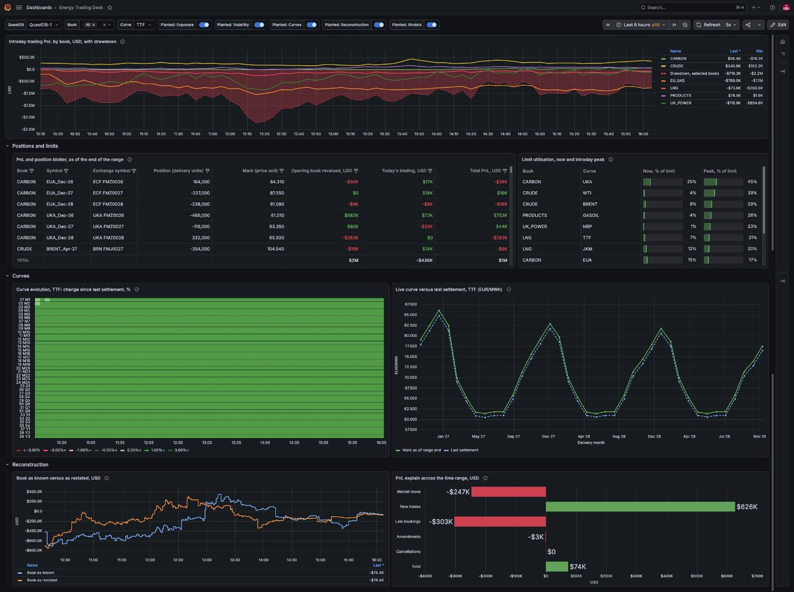

# Energy Trading Desk dashboard

One Grafana dashboard for the live session, built on the plain views the generator
creates (see "Views" in `../README.md`). Every panel is as of the right edge of the time
range: leave the range at "Last 6 hours" with auto-refresh for the live desk, or drag its
end into the past and the whole dashboard shows the desk as it stood then.



## Import

Requirements: Grafana 12.3 or later with the QuestDB datasource plugin, and a QuestDB
datasource pointing at the instance the generator writes to. Checked on Grafana 13.2.2
with plugin `questdb-questdb-datasource` 0.1.8, against QuestDB 10.0.2.

1. Dashboards > New > Import, upload `energy_desk_dashboard.json`.
2. Every panel reads the hidden `DS_QUESTDB` variable, which Grafana fills with the
   instance's QuestDB datasource on import; the JSON carries no datasource UID, so the same
   file serves a local instance and a cluster. With more than one QuestDB datasource, pick
   it under Dashboard settings > Variables.
3. Set the dashboard time range to include data. Times are UTC throughout: the data, the
   planted storyline and the dashboard.

The hidden `prefix` variable (`energy_`) is put in front of every table and view name;
change it if the generator ran with a different `--prefix`.

The refresh picker offers 250 ms, 500 ms and 750 ms as well as the usual intervals. Grafana
only honours them when the server's `min_refresh_interval` is 250 ms or lower; its
default is 5 s (`[dashboards] min_refresh_interval` in `grafana.ini`, or
`GF_DASHBOARDS_MIN_REFRESH_INTERVAL=250ms` for a container).

## How the as-of works

Every panel query starts by binding the views' overridable variables to the end of the
range:

```sql
DECLARE @asof := '${__to:date:iso}',
        @day  := timestamp_floor('d', '${__to:date:iso}'::timestamp)
SELECT ...
```

`${__to:date:iso}` is Grafana's range end as an ISO timestamp, which the views take as
`@asof`; `@day` is the start of that day. The plugin's macros bound the series windows:

| Macro | Expands to |
|---|---|
| `$__timeFilter(ts)` | `ts >= cast(<from> as timestamp) AND ts <= cast(<to> as timestamp)` |
| `$__fromTime`, `$__toTime` | `cast(<epoch micros> as timestamp)` |
| `$__sampleByInterval` | a `SAMPLE BY` unit for the panel's width, for example `60s` |

There are no per-panel time overrides: the picker is the only control.

**Live marks and official marks.** The panels a trader watches (the blotter, the curve
against settlement, the PnL curve, the front months) price at `marks_live`: the latest mid
on each instrument's primary listing in the five minutes up to `@asof`, falling back to
the curve builder's mark (`marks_asof`) where there is no fresh quote. The query pack and
the reconstruction panels value at `marks_asof`, the minute marks the curve builder
publishes, because official marks are what a controller signs off. At the same instant
the two agree within one quoted spread on every liquid front month; between minute marks
`marks_live` runs ahead of the last mark by however much the market has moved.

**Panel interval.** The PnL curve and the curve evolution sample on `$__sampleByInterval`,
with a minimum interval of 10 s, from `quotes_10s` (10-second bars on the primary listing).
At "Last 6 hours" the PnL curve's buckets are about 20 seconds; at 30 minutes they reach
the 10-second floor. The curve evolution caps itself at 200 columns, so at 6 hours a column
is about two minutes and at 30 minutes it is 10 seconds.

## Panels

| Panel | Type | Reads | Matches |
|---|---|---|---|
| Intraday trading PnL by book, with drawdown | time series | `positions_running_day`, `quotes_10s`, `curve_marks`, `instruments` | `1b_twin_window_function` |
| Front months, live | table | `quotes`, `listings`, `tenors_asof`, `settlements` | |
| PnL and position blotter | table | `ledger`, `marks_live`, `usd_factor_asof`, `listings` | `1a_pnl_by_book` at minute marks |
| Limit utilisation, now and intraday peak | table, gauge cells | `position_snapshots`, `fills`, `limits` | `2a_limits_now_vs_peak` |
| Curve evolution | status history | `quotes_10s`, `curve_marks`, `tenors_asof` | |
| Live curve versus last settlement | trend | `marks_live`, `tenors_asof`, `settlements` | `4a_live_vs_settlement` at minute marks |
| Book as known versus as restated | time series | `trade_events`, `marks_asof`, `usd_factor_asof` | `book_asof` at each minute |
| PnL explain across the time range | bar chart | `trade_events`, `curve_marks`, `quotes`, `instruments` | `6c_pnl_forensics_t1_to_t2` |

Notes on some of them:

- The front months table is the panel that ticks: one row per curve's front month on its
  primary listing, the latest quote in the ten minutes up to the range end, the change
  since the last settlement, and the age of the quote, amber over 30 s and red over 120 s.
  Primary listings only, so the planted EEX feed outage does not show here: the primary
  keeps ticking.
- The limits table compares positions with limits in delivery units, so it moves when a
  fill lands, not when prices move.
- The PnL curve values each bucket at that bucket's mark and FX rate (the 10-second bars),
  so on refresh only the newest bucket changes; history stays put. An instrument with no
  bar yet in the range takes the curve builder's mark at the range start. The drawdown is
  measured over the range, so it can step when the session high leaves a sliding range.
- The curve evolution shows each tenor's change since the start of the range, in percent:
  it starts at zero on the left and shows how the curve moved. Grey is within 0.25 %; the
  colour steps are 0.5, 1 and 2 % either way for gas and power, and half that for Brent,
  WTI and gasoil, which move less. Rows are tenors front to back, months, then quarters,
  seasons and cals. The comparison with settlement is the panel to its right.
- The book-as-known line is the value of the day's deals as the booking log showed it at
  each minute; the as-restated line puts every deal at its final version, as known at the
  range end, at its trade time. Both use the marks of the range end, so the gap is purely
  bookings. The lines meet at the right edge.
- PnL explain splits the change in value of the day's deals between the range start and
  end into market move, new trades, late bookings, amendments and cancellations, which
  add up to the total. Example, 12:00 to 15:00 on the demo day, all books (USD):
  market move -2,681,727, new trades 356,094, late bookings 157,946, amendments -730,544,
  cancellations -236,450; sum -3,134,681, the total.

The planted events from `demo_events` appear as annotations on the time-series panels,
with the act as the marker's tag. It is one query, and its toggle is hidden from the
controls bar, on purpose: Grafana re-runs annotation queries on every refresh and a
visible toggle shows a loading spinner each time, while the variables (`book`, `curve`,
the datasource) refresh only when the dashboard loads. To switch the markers off, use
Dashboard settings > Annotations > "Planted events".

## The two demo moves

1. **Live.** Range "Last 6 hours", refresh 1 s, with `energy_realtime.sh` running. The
   front months tick on every refresh, the blotter's marks and PnL move with the market,
   the limits move with every fill, the PnL lines' last segment moves within seconds, and
   the curve evolution adds a column on its interval.
2. **Reconstruction.** Pause the refresh and set the range to 12:00 to 14:00 UTC on the
   demo day. The blotter and the limits show the desk as of 14:00; the as-known line
   steps at 13:20, when the LNG fill booked with ten times its quantity at 10:05 is
   corrected, and PnL explain carries that correction under amendments. Then move the range end to 14:35:
   the duplicate TTF quarter cancelled at 14:05 lands under cancellations, and the UK
   power season dealt at 09:10 and booked at 14:30 lands under late bookings and in the
   restated line.

A cancellation or amendment shows in PnL explain only when the trade existed at the range
start: a deal booked and cancelled inside the range was never in the opening book.

## Checks

On the scale 1 dataset, against the query pack at the same instants: limits equal
`2a_limits_now_vs_peak` (within the cell's one-decimal rounding); the book-as-known line
equals `book_asof` valued at the range-end marks at every minute checked, and its right
edge equals `6a`'s `mtm_as_known`; PnL explain equals `6c` component by component. Every
panel renders with `book` set to All and to two books.

Live against official marks:

- `marks_live` against `marks_asof` on the nine front months at 40 minute boundaries in
  European hours on 7 and 8 October: 360 of 360 within one quoted spread, the widest half
  a spread. Instruments with no fresh quote fall back to `marks_asof` and are identical to
  it (32 of them at 03:00 on the demo day).
- The blotter on live marks reconciles to the same blotter on minute marks (the `1a`
  valuation) by position times the difference between the two marks. At 12:00:30 on the
  demo day, all books, in USD:

  | Book | Live marks | Minute marks | Difference | Position x (live - minute mark) |
  |---|---|---|---|---|
  | CARBON | -313,562 | -353,976 | 40,414 | 40,414 |
  | CRUDE | 1,175 | 30,950 | -29,775 | -29,775 |
  | EU_GAS | 1,813,653 | 1,818,179 | -4,525 | -4,525 |
  | LNG | 323,616 | 325,541 | -1,925 | -1,925 |
  | PRODUCTS | 629,475 | 651,475 | -22,000 | -22,000 |
  | UK_POWER | 3,501,507 | 3,505,992 | -4,485 | -4,485 |

Movement, at 1 s refresh in European hours on 8 October: over 20 refreshes the front
months table changed 19 times and the blotter 19 times; the PnL curve's last values
changed within 2 seconds. Curve evolution, share of grey cells in an hour without a
curve-wide move: TTF 13:00 to 14:00 on the demo day 89 %, Brent 14:00 to 15:00 on 8
October 84 %; on the demo day between 10:00 and 13:00 the four winter months end 5.6 to
7.4 % up after the 11:00 repricing while the summer months stay within 0.3 %.

Load: every panel query sent through Grafana every 5 seconds for 10 minutes against the
live generator, range "Last 6 hours", all books (120 rounds, no errors). Median per panel
18 to 92 ms, the slowest single query 582 ms (the hero). At 250 ms refresh the heavier
panels can skip a beat.
